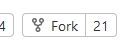
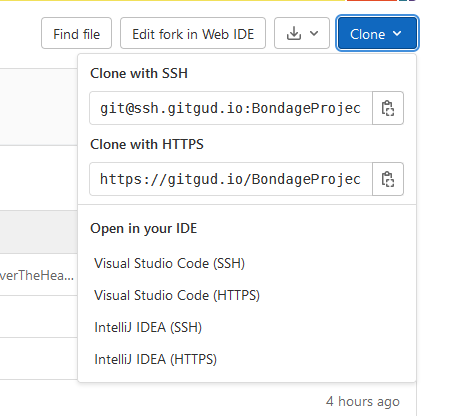
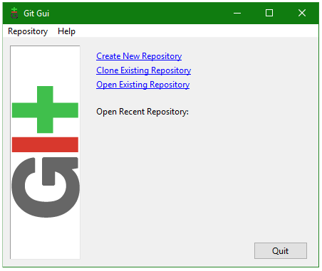

# The BondageProjects Guide to Git

## Introduction

The goal of this guide is to teach you how to use Git and GitGud effectively. 
It uses Ben987’s game **Bondage College / Bondage** Club as an example, for anyone who wants to contribute to it, be it code for a new feature, a translation, or bug/typo fixes. 
However, this knowledge can be helpful in other contexts as well; if you’re a programmer and have never worked with git before (or just don’t fully understand it), knowing more about it should help you a lot in the future, no matter if you’re working alone or in a team. 
But even if you’re not a programmer, Git might be a useful tool for you as well if you work with any kind of digital files.

This guide assumes Windows as the operating system, as well as basic computer literacy (you know how to navigate your folders, copy & paste, use common software etc). 
You should also be at least willing to try using the command line (the commands you'll need will be explained, and GUI alternatives are mentioned if you need them).

Please note that I do not claim to be an expert in this field. 
I never had professional training related to Git, all of this is just based on personal experience and knowledge that I’ve gathered from various sources. 
There may be other, better ways to use it, this is just the way I found to be the most useful in the long run. 
Learning Git on your own can be difficult, especially if you’re not sure what it’s all about, since many tutorials out there focus on specific aspects and assume you already know certain things as a prerequisite. 
This guide aims to provide a start-to-finish tutorial based on a solid example, that will hopefully make things easier to understand and follow along.

Throughout the guide, you will occasionally see additional background information in special boxes like this one:

>**Git** is the name of a free distributed version control software.
What this means is that it basically keeps track of your files for you; it remembers any change you made and committed, and lets you return your files to a previous state if you’ve made a mistake. 
You can even roll back multiple changes you’ve made over long periods of time, as long as you’ve already been using git at the point in time you want to return to. 
Another feature is that it allows multiple people to work on their own copy of a project, and then merge all of those different parts back together. 
Git is primarily intended for programmers, but it can be useful for any work involving digital files, if being able to collaborate with others or keeping track of all changes is desirable.


Reading these boxes is optional. 
If all you’re after is a step-by-step guide on what to do, feel free to skip them. 
If you have the time to spare however, I highly suggest you read them, as they will help you understand what you’re actually doing, and why you’re doing it.

The guide is divided into two main sections: 
 - [**Setup**](#section-1:-setup) is what you need to do before the first time you want to contribute to the project, and in parts also if you switch to another device. 
 - [**Workflow**](#section-2:-workflow) is the actual process you’ll be following every time you want to make a new contribution.


## Section 1: Setup

>Due to recent events, the project is no longer hosted on GitHub, instead hosted on GitGud, a platform permitting hosting and collaboration of Git-based projects similar to GitHub. 
> Please keep in mind they are not the same thing. Git is the system itself, while GitHub is the service many people use in conjunction with it. 
> If you were using Git for your own private project on your personal computer, and nobody else was working on it with you, you wouldn’t even need to use GitHub, as everything would work locally. 
> What GitHub offers is a way to store your Git projects online, to let you synchronize your work on multiple devices, to allow for collaboration with others, or to simply act as a backup storage.

### Step S-1: Create a GitGud account

Before doing anything else, you’ll need a GitGud account your work can be attributed to. 
Go to https://gitgud.io/ and sign up for a new account, unless you already have one, of course. 
The first thing you should see is a sign in option with Sapphire, whereupon you can sign up for an account

When making a new account, it’s best to use an email address that you don’t mind being associated with this context. 
But don’t worry, GitGud will do what it can not to let it leak anyway, and you can take additional steps to ensure it (more on that later). 
If you want to appear in the game’s credits, it’s also helpful to pick a username you want to be listed as, however this can also be communicated separately.

### Step S-2: Fork the repository

Now that you have an account, go to https://gitgud.io/BondageProjects/Bondage-College. 
What you’re looking at here is Ben987’s main repository for the games. 
(Note: If you’re looking to contribute to Bondage Club, don’t worry, you’re in the right place. 
This repository contains both [Bondage College](..) and [Bondage Club](../BondageClub).)

>A repository (or repo, if you don’t have much time) is, in simple terms, a location containing your Git project. 
> It could be located on GitHub, on your company’s server, or even on your very own computer.
>
>At first glance, a repository is just a regular folder or directory containing all the files that belong to your project. 
> If you dig deeper, however, it’s a lot more than that. 
> A repository contains information about its entire history ever since its creation. 
> It contains every change ever made to every file - even those that were deleted at some point - along with additional information such as the date or the person who made (committed) that change. 
> Using the proper tools or commands, this makes it possible to search the history, for example to restore a previous version (without losing the current one) and find out when a certain bug started appearing. 
> If you ever viewed the editing history of a Wikipedia article, it’s a very similar concept. 
> If a repository is located on a server (or a public platform such as GitHub), usually changes can be made (pushed) to it remotely across the internet. 
> However, most repositories only give write access to their owner, and to accounts that the owner has decided to grant access to, preventing anyone else from adding their changes and making a mess.

Since you can’t make changes to the repository directly (allowing write access to everyone would be very dangerous to the project), you’ll need a way around it. 
You’ll need to create a fork.

While logged into GitHub and viewing the repository linked above, click the **Fork** button in the top right of the page. 
(Be sure to click the button itself, not the number next to it.
The latter will take you to a list of all the forks others have created of this repository.)  


After that, you will be taken to a page that at first glance looks the same. 
However, it should now have your account name displayed instead of Ben987. 
You now have your own repository under the URL: \
**https:\//github.com/<ACCOUNT_NAME>/Bondage-College**.

>“Forking” technically isn’t a term or practice used inside the Git system itself. 
> Rather, it’s a higher-level concept that GitHub makes use of to allow for a better way of community interaction.
>
> As mentioned earlier, most repositories on GitHub can be viewed and read by anyone, but can only be modified by people that were specifically given access by the owner (for good reason). 
> If someone wanted to allow the entire community to be able to contribute to their project, they could technically just give write access to anyone who asks; doing so would be very risky, however, since it would allow anyone to sneak in malicious or untested code, and with full access, the commit history could even be altered to irreversibly break the project. 
> The repository would quickly fall into chaos.
>
> To work around this, GutHub allows anyone to “fork” public repositories. 
> This basically creates a full copy of the entire repository, in the exact state it was in at the time of froking; the key difference being that you are now the owner of this copy, and can freely change it whichever way you want. 
> None of the changes you make in your fork will directly affect the original repository, so you could just go wild if you wanted to. 
> Just be sure to consult the original repository’s licence (if it has one) before you decide to run off and do your own thing with the fork.
>
> After you made a change in your fork that you think should be in the main project, you’ll be able to let the original owner know about the changes you made, and ask them to “pull” them over into their main repository (more on that later, on the subject of Pull Requests). 
> This process allows the original owner to review and test your changes before deciding to either accept or decline them. 
> That way, forks allow anyone to contribute to a project, while also protecting it from direct harm.

Now that you have our own fork, you’re technically all set. 
If you know you only want to make a single, simple change to the game, and you don’t really care about the rest on how to optimize your workflow for the future, you can probably figure out how to upload or change files in your fork directly on GitHub, without even really needing to download or install anything. 
If that’s what you want to do, you can go ahead and skip straight to [Step W-5: Make a Pull Request](#step-w-5-make-a-pull-request).

However, if you prefer doing things the right way and having a painless system in place for your future contributions, read on.

### Step S-3: Install Git on your computer

Visit the official download page https://git-scm.com/downloads and use the appropriate download link depending on your operating system (keep in mind that this guide assumes Windows, it may not be much help if you’re using Mac or Linux). 
After the file has finished downloading, execute it to run the installer.

Proceed through the installation like you would with any other program. 
Note that the installer includes a bunch of settings and choices; if you don’t understand what they mean, you can leave them at the default settings, as they’re mostly fine for our use case. However, there are a few you should pay closer attention to.

In the step **“Choosing the default editor used by Git”**, it’s highly recommended to change the selection to something other than Vim, unless you’re familiar with that program and know how to use it. 
Change this to another editor you have installed on your machine and are comfortable with it (when in doubt, Nano should be fine). 
The choice shouldn’t matter too much since we won’t usually need to edit files directly through git, but just in case it happens, the editor should be something you at least know how to close.

When you reach the step **“Adjusting your PATH environment”**, make sure the option **“Git from the command line and also from 3rd-party software”** is selected. 
It’s not strictly necessary if you’re just following this tutorial, but it will be useful if you want to keep working and experimenting with Git later on, as this allows other tools to find and work with your Git installation.

Once finished, the installer will have installed Git on your system, as well as a pair of tools to go with it: Git Bash and Git Gui. 
Git Bash is similar to the default Windows Command Prompt / Shell / Console, except that it’s specialized for working with Git, displaying information about your repository and highlighting output in different colors (note that if you don’t need that, all the Git commands should function just as well in the normal shell, now that Git is installed). 
Git Gui is a graphical interface that offers the most important features of Git in the form of buttons and menus.

To see if it worked, navigate to any folder in your Windows Explorer, and click the right mouse button. 
In the context menu, the items **Git GUI** here and **Git Bash** here should now be visible (if they aren’t, you may need to restart your computer first). 
Click on **Git Bash** here and wait for text to appear in the newly opened console window. When you see a blinking cursor next to a **$** sign, type:

```git --version```

and hit Enter. 
If a version number is displayed (rather than an error message), your Git installation was successful!

This guide will mostly tell you to use commands like this to achieve certain things. 
Most of these things can also be achieved via similar sounding options in Git GUI, if you prefer.

**Aside**: *You may find that GitBash and Git GUI, while official, may not exactly be the most user-friendly or nice looking tools in existence. 
For now though, they should be good enough for you to get a feeling of how Git works. 
Once you’re comfortable with that, you may want to start looking for alternatives. 
GitHub Desktop is a popular and modern application that integrates directly with GitHub. 
Appealing as that sounds, it’s unfortunately not very well suited for our kind of project, as some important features are missing from its UI (namely support for multiple remote repositories, at the time of writing). 
A better choice may be the similarly popular TortoiseGit, which adds options for virtually every Git feature to your File Explorer’s context menu. 
It takes a bit more know-how to set up, but overall feels far more complete. 
Neither of these tools will be explained in this document, as we can do all we need to do without them, but you should at least be aware of their existence.*

### Step S-4: Clone your fork

> To clone a repository basically means nothing more than to create a copy of it in another location. 
> Most of the time, it means cloning a repository from a server or a platform like GitHub to your local machine, but it can also be used to simply make a copy for other purposes.
>
> On a repository’s main page, GitHub offers the option to “clone or download”. 
> Some might ask, “What’s the difference?” Keep in mind that a repository is more than just a collection of the files you see in their current form. 
> Downloading will give you a Zip file containing only these files, which is fine if that’s what you want. 
> Cloning, however, will give you the entire repository to work with, including all the past revisions with files that might have been moved or deleted at some point, as well as any branches the repository might have (more on those later).
>
> More importantly, cloning, and therefore having an actual repository on your computer, is essential if you want to use Git for making your contributions. 
> Without it, you’d have no efficient way to keep track of what was changed, and getting your changes merged back into a repository without breaking anything would be both time consuming and error-prone.

Back on GitGud, go to the main page of your fork (the one with your user name in the URL) and look for the blue “**clone**” button. 
Click it, and you should see 2 text boxes containing an address. 
Click the icon right next to "Clone with HTTPS" to copy that address to your clipboard.
You also have the option of cloning via SSH or importing them with select IDEs


Now, navigate to any folder on your computer that you’d like the local copy of your fork to be located in. 
Once there, right-click inside that folder and choose Git GUI here. 
A window should open, looking something like this:



Since we already have a repository (our fork on GitHub), click the ***“Clone Existing Repository”** option. 
In the next window, paste the address you copied earlier into the text box next to **“Source Location”**. 
Then, use the “Browse” button next to the **“Target Directory”** box to choose the folder you want to clone the repository into. 
The tricky part here is that Git GUI won’t let you select a folder that already exists, so you’ll need to choose a “containing” folder in the file dialog, and then manually add a slash (/) and a name for a new folder at the end of the text box.

After both boxes are filled out, leave the options below as they are and click **“Clone”**. 
A new window will open for this process, and since the repository is rather large, it might take a while, so be patient. 
After it’s done, yet another, more diverse window should open (which you can safely close for now) and there should be a new folder in the directory you specified, containing your cloned repository.

### Step S-5: Configure

Almost done with the setup! 
There’s just a few more little things we need to do to prepare the local repository for our workflow. 
First, let’s add a remote reference to the original repository so we can always keep our copy up to date.

> Basically speaking, a remote is a reference inside a repository, pointing to another repository that's located somewhere else. 
> A repository can have multiple remotes, with different, customizable names to tell them apart. 
> If your repository was cloned from another one, it's usually going to reference that repository you cloned it from as a remote called “origin”. 
> As long as you have write access to that remote, this will allow you to easily push your local changes back to it. 
> In other words, if your repository is on your local computer and the “origin” remote is your fork on GitHub, this will allow you to “upload” your changes, so to speak. 
> The reverse is also true: if the content of your fork has changed for some reason (for example after pushing to it from another device), you can pull those changes into your local clone, only having to reference it by the name “origin”.
>
> In our scenario, it would make sense to also add the original repository (the one we forked from) as an additional remote. 
> This kind of setup isn’t uncommon when working with GutHub, and this second, higher-up remote is traditionally called “upstream”. 
> Having a convenient link to the upstream will be the key to keeping the origin up to date.

Navigate to your repository’s main folder (the one containing the files “index.html” and “README.md”, among others), right-click and select Git Bash here. 
Just like at the end of Step S-3, wait for the $ prompt and then enter the following (in a single line):

```git remote add upstream https://github.com/Ben987/Bondage-College.git```

When the next prompt appears, you can type the following to verify it worked:

```git remote -v```

If everything went well, the console should now display two lines starting with “origin” (pointing to your fork) and two more lines starting with “upstream” (pointing to the original).

You’re technically all set, but there’s one more thing you might want to do if you’re concerned about privacy. 
Open Git GUI (by right-clicking inside your repository’s main folder and selecting Git GUI here), and select Edit → Options… in the new window’s top menu.

You should now see a settings window that’s divided in two mostly identical halves. 
On the left are the settings for your current repository, on the right are the global settings that get applied to all new repositories you clone or create. 
Most of the settings can stay as they are, but take a look at the “User Name” and “Email Address” fields. Git uses these internally to identify who made which contribution. 
Your user name can be the same as on GitHub, but unless you want your email address to be exposed, do the following:

Assuming you’re logged into GitGud, visit https://gitgud.io/-/profile in your browser (you can also get here by clicking your user icon in the top right, selecting “Edit Profile” in the pop-up menu). 
You will find dropdown menus describing all email options regarding privacy  
It will work as identification, but nobody will be able to use it to send you mail. 
Copy and paste this address into the settings window (at least on the left side; you can do the same on the right if you want future repositories to use this address as well).

## Section 2: Workflow

### Step W-1: Update your master branch

Note: If you’re following this tutorial along in order and are doing this immediately after the setup, you can most likely skip this step for now. 
It will be important for any subsequent contributions you want to make, but unless you let a lot of time pass, both your fork on GitHub and your local repository should already be up-to-date. 
To check if it is, go to your fork’s main page and look at the gray bar above the list of files and folders. 
If it says “This branch is even with Ben987:master”, you’re good, just skip ahead to [Step W-2](#step-w-2-create-a-new-branch). 
Otherwise, you might want to follow these instructions to get your fork up to date.

Make sure you don’t have any uncommitted changes (you won’t have any if you’re following the guide in order and haven’t played with the files yet). 
Navigate to your repository’s main folder (the one containing the files “index.html” and “README.md”, among others), right-click and select Git Bash Here. 
A command prompt will open, wait a moment for it to load properly until it’s displaying the path to your repository and a blinking cursor next to a $ sign.

Then, enter the following commands in order (some of them might take a moment to finish, wait until the $ prompt reappears each time):

```git checkout master```

This will switch you over to the master branch, if you aren’t on it already. 
Then, we’re going to download any new changes from the upstream repository (the original one owned by Ben987)...

```git fetch upstream master```

...and merge those changes into our own repository’s master branch:

```git merge upstream/master```

Your local master branch should be up to date now. 
Before continuing with the next step, it might be a good idea to also push these newly added changes into the online version of your fork (the origin remote):

```git push origin master```

After executing this command, you may be asked for your GitHub username and password. 
Enter both (you may need to enter one in the command prompt and the other in a separate window that pops up) to complete the process. 
When you visit your fork on GitHub after this, your master branch there should be up to date, and the “This branch is even with Ben987:master” line should be displayed.

### Step W-2: Create a new branch

> Remember how a repository contains a full history of all changes made to the files? Well, branches let you split up the history into separate timelines.
>
> Every repository starts out with one main branch, usually called the “master” branch. 
> When you create a new branch off of it, it will have the exact same previous commit history, but going forward, it’s going to be completely independent. 
> When you make new changes on this new branch, the master branch will stay unaffected by them, and vice-versa.
>
> Another term that should be explained in this context is the so-called working tree. When working with a local repository, your working tree is basically the folder containing all the files you’re working with. 
> More precisely, it represents the branch you’re currently working on. 
> You can switch between branches using the git checkout command, but only the currently checked out branch will be present in your working tree, the other branches are stored inside a hidden .git folder. 
> When you checkout a different branch, the files in your working tree will be changed to match the state of that branch. 
> Git usually won’t let you switch branches if your working tree contains uncommitted changes.

One last step before getting to work is to create a new branch in your repository to do that work in. 
First, make sure you’re on the master branch (you should be if you’ve followed this tutorial in order, no matter if you skipped step W-1 or not).

If it’s not already open from the previous step, open Git Bash by navigating to your repository’s main folder (the one containing the files “index.html” and “README.md”, among others), right-click and select **Git Bash Here**. 
A command prompt will open, wait a moment for it to load properly until it’s displaying the path to your repository and a blinking cursor next to a **$** sign.

Then, create a new branch like so:

```git checkout -b NAME_FOR_NEW_BRANCH```

Replace ```NAME_FOR_NEW_BRANCH``` with whatever you want your new branch to be called. It should ideally be related to the feature you’re planning to develop, or whatever else it is you want to do. For reference, the checkout command is generally used to switch to a different branch, but the -b flag is used to create a new branch, and then switch to it.

Note that this new branch is only present in your local repository for now - it won’t appear in your GitHub fork until you push it later.

> Why are we creating a new branch right now? 
> Because in a situation like this, where we plan to potentially make multiple contributions to a repository we forked, it’s generally a good idea to keep the master branch untouched.
>
> The reason for this might be a bit hard to understand at first.
> We technically could make our changes right inside the master branch, do a pull request, wait for it to be accepted, and start working on the next thing. 
> Except that’s gonna be difficult, because now we’ll have commits in our master branch that differ from the ones in the upstream repository (the content may be the same if it gets accepted, but the commits themselves won’t be). 
> It will now be almost impossible to get our master branch updated to the new state of the upstream repository, at least without throwing everything out and basically starting over.
>
> You can picture this like two trees that started growing identically, but then kept growing in slightly different ways - when tasked with making them both equal again, Git won’t know which parts of the recent history to keep, or how to combine them. 
> It’s much easier if we branch off instead to do our own thing, keeping our master branch exactly the way we found it. Later on, when we decide to update our master branch, all Git has to do is to copy the new changes from the upstream repository over to us - since our master branch didn’t keep growing on it’s own, there’s no conflicts to be concerned about.
>
> Meanwhile, we’ll have made our changes on our new, separate branch, which we would then use to make our contribution. 
> When it gets merged on the upstream repository, it will become part of the master branch, which we then use to update ours. This way, our changes will end up in our master branch if and when they have actually become part of the project.

### Step W-3: Make your changes

It’s finally time to do what you came here to do: make your modifications to the game! 
Basically, just edit the files inside your local repository any way you want to.

There isn’t much to tell you about this in this guide, since what you need to do largely depends on what you actually want to do. 
You should know that all the files for Bondage College are accessible from the top level folder, while the Bondage Club files are located in a subfolder appropriately named “BondageClub”.

If you’re adding new functionality or fixing a bug, try to familiarize yourself with the code first and make your changes in a way that follows a similar style and convention. 
If you want to add a translation, examine the existing translation files to understand how they work (hint: peek into the “\BondageClub\_Translation\Tools” folder, too). 
If you’re modifying or adding new assets, simply do so with the image editing software of your choice.

One personal recommendation if you’re working with code and/or text files is to use Visual Studio Code, since it’s a powerful, fast and modern text editor that actually offers some Git integration. 
If it detects Git on your computer, it can keep track of and highlight all your changed files and lines for you. 
It even gives you access to some Git commands right inside its interface.

### Step W-4: Stage, Commit, Push

After you’ve made your changes and are happy with them (be sure to test them by opening the index.html file in your browser, of course), it’s time to make a commit. 
This tells Git to make your changes part of the repository’s commit history.

Personally, I actually prefer using Git GUI for this step, but the Bash commands will be provided later, for consistency.

Right click inside your repository’s main folder and select “Git GUI here”. 
In the top left in the new window, you should now see a list of all the files you’ve changed or added, and if you click on them, the exact lines you changed (assuming it’s a text file) will be displayed and highlighted in the big box to the right. 
This is a good way to skim over everything once more and make sure you didn’t miss anything.

Before your changes can be committed you first need to stage them. 
This is just an additional step to tell Git which files are actually supposed to be part of the commit. 
To stage all your changed files (as you’ll usually want to), just click the “Stage Changed” button in the bottom section of the window. 
If any of the files are new, you may be asked if Git should start tracking them. Simply answer with yes.

In the text box next to the buttons, you can now enter a commit message, summarizing the changes you made. Ideally, this message should be short and to the point, just a few words should be enough. 
You can explain what you did in greater detail later when you make the actual pull request. With the message written, you can now click the “Commit” button to add a new commit containing all your changes to the history.

Your changes are now part of your repository, but they’re still local. 
To get them online, we need to push them back into your fork on GitHub. Click the “Push” button, right underneath the previous one. In the newly opened window, make sure your current branch is selected (as well as “origin” for your destination repository) and then confirm by once again clicking “Push” in this new window. 
Wait for your commits to be uploaded (you may be asked for your GitHub username and password during this process). 
After it’s done, you can visit your fork on GitGud again and click the “Branch: master” dropdown to select the branch you just pushed. You should now be able to see your commits there.

Note that you can commit and push multiple times (or make multiple commits and then push them all at once) before you finish your work and move on to the next step. 
This is especially useful if you intend to make big changes to the game that might take some time. Making occasional commits and then pushing them online will ensure you have a backup and won’t lose your progress.

If you don’t like switching to a GUI for this, here are the commands to do the same thing in Git Bash:

```git status```

...to view a list of all the files you changed.

```git add .```

...to stage all your changed files to be committed.

```git commit -m "<COMMIT MESSAGE>"```

...to commit the stage files with the message specified in the quotes.

```git push origin <BRANCH NAME>```

...to push your local commits to your online fork.

### Step W-5: Make a Pull Request

This is it! After you’ve made, committed, and pushed your changes to your fork, it’s time to get them from your fork into the “real” repository to actually get them into the game. 
Since you can’t do this directly by yourself (for reasons discussed earlier), you’ll need to file a request for your changes to be pulled from your fork.

Go to your fork on GitHub, and switch to the branch you’ve been working on by using the dropdown menu that says “Branch: master” by default.

Directly under the green “Clone or download” button, you should see two links saying “Pull request” and “Compare”. 
It’s generally not a bad idea to click on “Compare” first, as this gives you a full summary of all the files and lines in this branch that are different from the ones in the main repository’s master branch. 
You might want to take a closer look at this list, to make sure everything is as it should be. 
Once satisfied, go ahead and click “Pull request” (or the green button saying “Create pull request” on the compare page).

All you need to do now is enter a title and a description for the pull request. 
Contrary to commit messages, here it’s a good idea to be as descriptive as possible and explain what effect your changes will have on the game. 
When done, click the green “Create pull request” button right under the form.

And finally, that’s all. You may need to wait a while for your pull request to be accepted into the game, and of course be aware that it may also be rejected for any reason. 
A discussion about it with Ben987 can take place right on the pull request page, or on other community platforms you’re active on. 
Depending on the nature of your pull request, sometimes things may need to be adjusted before your changes can be merged.

If everything went well, congratulations on your first contribution to the project! 
I hope this guide was helpful and understandable. 
Feedback and questions can be directed @adokilume#1553 on Discord.


